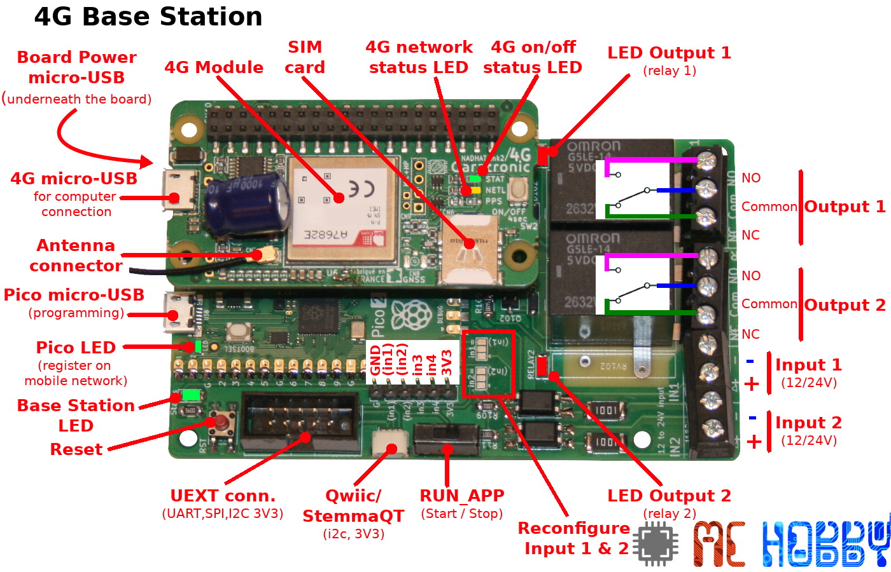
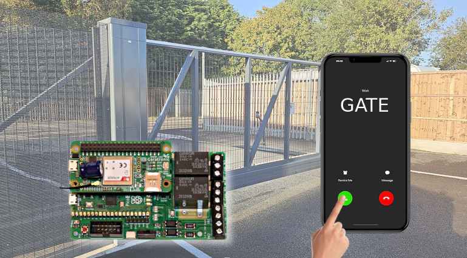
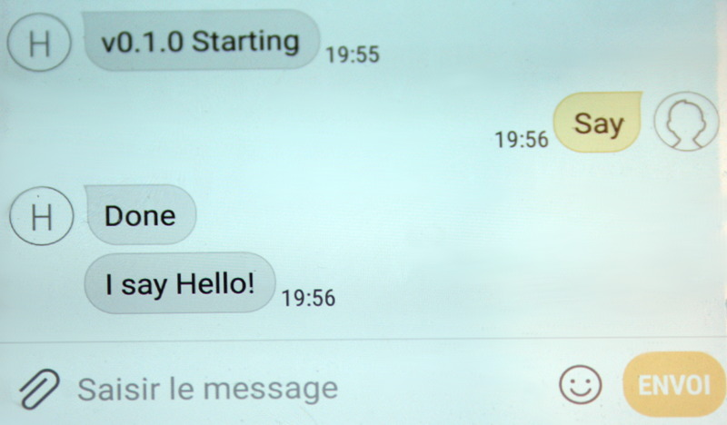
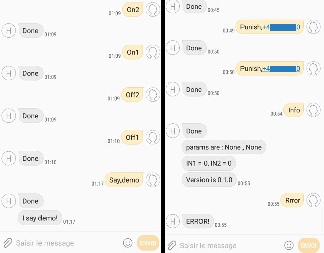
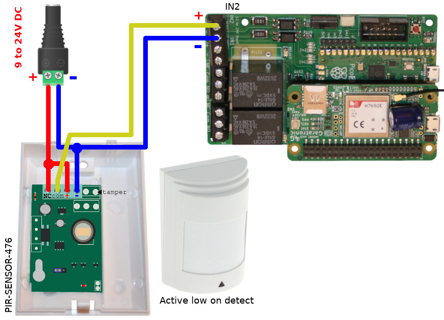

# 4G-BASE-STATION - 4G based MicroControler board properled with MicroPython
The 4G base station is designed to run microcontroler based solution.



The board offers the following features:

* __2x relay output__ : this galvanic isolation allow to control high power devices. By design this output can be used up to 24V DC or 48V AC. 
* __2x opto-isolated input__ : able to read 12V / 24V input signal.
* __2x 3,3V input__ : for extra application
* __1x UEXT port__ : exposing a SPI bus, I2C bus UART and 3,3V power for custom application
* __1x Qwiic/StemmaQt port__ : exposing 3V3 I2C to connect i2C board/sensor for custom application
* __Pico Powered__ : powered with Raspberry-Pi Pico 2 microcontroler. 
* __MicroPython Powered__ : this solution is written in python. The code can be tuned to your need. See the technical documentation for schematic and details.
* __5V Powered__ : the entire project runs with 5V micro-USB power supply.
* [Schematic](docs/_static/4G-Base-Station-Schematic-r1.jpg)

# Projects
Open-Source projects developped with MicroPython for the 4G Base Station board.

## Basics

The [basic examples](examples/basic/) demonstrate the basic interactions with the board with MicroPython.

The [micropython-A7682E-modem](https://github.com/mchobby/micropython-A7682E-modem) repository introduce the classes and python code for dealing with the 4G module.

The [esp8266-upy](https://github.com/mchobby/esp8266-upy) repository contains __many MicropPython drivers__ for dialing with sensors and actuators in MicroPython. You can also check [awesome-micropython](https://awesome-micropython.com/).

## Gate-control

The aim of the [gate-control project](examples/gate-control) is to be able to control a gate (or a door) with phone call and SMS messages.



The [User manual (gate-control.pdf)](examples/gate-control/gate-control.pdf)  introduces all the details required to configure and use the gate-control.

__Extending gate-control :__

Being delivred with source, this project can be tuned and improved to suits your need. 

The `GateControlApp` class can also be derived into newer class to implement your own SMS instructions (see [test_myapp.py](examples/gate-control/test_myapp.py)).

``` python
from gatectrl import GateControlApp

class MyApp( GateControlApp ):
	def __init__( self ):
		super().__init__()
		# *** CREATE YOUR OBJECTs GHERE ***

		# Intercept message: "say,first_param,second_param" parameters are optional
		self.register_sms_handler( 'say' , self._say_response ) # Keyword limited to 6 chars.

	def update( self ):		
		# Called again and again at each loop execution
		# *** PERFORM YOUR OBJECTs UPDATES HERE ***
		
		# Execute Normal operation here
		super().update() 


	def _say_response( self, msg, params ):
		# msg: incoming message
		# params[0] : None or the first parameter value (as string)
		# params[1] : None or the second parameter value (as string)
		
		# *** COMPUTE YOUR RESPONSE HERE ***
		self.register_notifications( notif_for=msg.phone, msg='I say Hello!' )


app = MyApp()
app.power_up()
app.run()
```

Which can be easily tested as shown on the picture here below:



## SMS-control

The aim of the [SMS-control project](examples/sms-control) is to control devices with SMS messages.


The SMS-control is based on __keyword__ commannd (up to 10 chars) accompagned with 2 optionals parameters (coma separated).

The SMS-control already contains some basic keywords (see user manual) and is designed to easily implement your own __keyword__ and actions.



To make it simplier, the SMS-control doesn't implement security features (as the Gate-Control does). Whatever, user code can surchage the `is_auth()` method to restrict the sender to some phone number (see example).

The [User manual (sms-control.pdf)](examples/sms-control/sms-control.pdf)  introduces all the details required use and program the SMS-control.

# Wiring

## Alarm PIR Sensor
The opto-isolated inputs can be used to wire PIR ALARM sensor, the kind sensors used to detect movement in a room.



Using higher voltage signal is quite handy to avoids noise disturbance. 

Due to sensor and input electronic, the INPUT is:

* __LOW__ : when intrusion is detected.
* __HIGH__ : when nothing occurs.

Such sensors __can be daisy chained__ on a single input (as shown on the [PIR-SENSOR-476 wiki page](https://wiki.mchobby.be/index.php?title=Micropython-PIR-alarm) )

# Shopping list

* [4G-Base-Station kit is available at MCHobby](https://shop.mchobby.be/fr/nouveaute/2888-4g-base-station-4g-controled-board-with-relays-and-optocoupled-input-micopython-ready-3232100028883.html)
* [PIR-SENSOR-476 : Alarm PIR sensor (covering 10 x 10m room)](https://shop.mchobby.be/product.php?id_product=2890)
